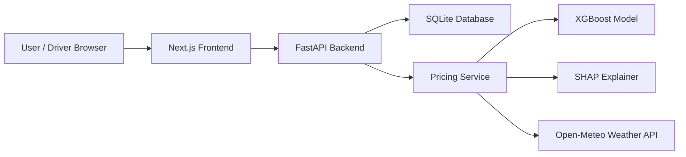
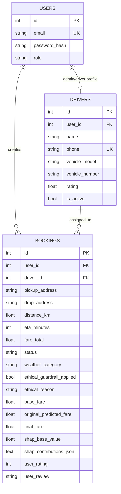

# AurumRide Final Report Draft

## Title

AurumRide: Ethical and Explainable Dynamic Pricing System for Ride-Sharing Platforms

## Abstract

AurumRide is a full-stack academic prototype for ride booking with AI-assisted dynamic pricing, explainable AI, and ethical surge guardrails. The system combines a Next.js frontend, FastAPI backend, SQLite database, XGBoost fare prediction model, SHAP explanations, live weather context, JWT authentication, and driver/user workflows. The main contribution is not commercial dispatch automation, but transparent and auditable fare calculation where the final price, AI prediction, SHAP feature impacts, weather state, and guardrail reason are visible and stored.

## Problem Statement

Ride-sharing platforms often use dynamic pricing without clearly explaining why a fare increased. During sensitive conditions such as heavy rain, high surge pricing can appear exploitative. This project addresses the need for a transparent pricing prototype that predicts fare, explains model behavior, and applies a rule-based ethical cap.

## Objectives

- Build a user-facing ride booking workflow.
- Build a driver/admin workflow for assigned bookings and profile management.
- Integrate ML-based fare prediction using XGBoost.
- Explain fare prediction using SHAP feature contributions.
- Apply ethical guardrails for weather-sensitive surge scenarios.
- Store booking-level pricing audit data.
- Provide demo-ready documentation, test evidence, and ML evaluation artifacts.

## Technology Stack

| Layer | Technology |
|---|---|
| Frontend | Next.js, React, TypeScript, Tailwind CSS, Leaflet |
| Backend | FastAPI, Pydantic, SQLAlchemy |
| Database | SQLite for prototype; PostgreSQL recommended for production |
| Authentication | JWT, Argon2 password hashing |
| ML | XGBoost Regressor, scikit-learn, pandas, NumPy |
| Explainability | SHAP TreeExplainer |
| Weather | Open-Meteo API |
| Testing | Pytest backend tests, frontend lint/build checks |

## System Architecture

## Folder Structure

| Folder/File | Purpose |
|---|---|
| `frontend/` | Next.js UI, map booking flow, auth screens, driver panels |
| `backend/app/api/` | FastAPI route modules |
| `backend/app/models/` | SQLAlchemy database models |
| `backend/app/schemas/` | Pydantic request/response schemas |
| `backend/app/services/pricing.py` | ML prediction, SHAP, weather, ethical guardrail |
| `backend/app/core/` | config, security, auth dependencies |
| `ml/` | training/evaluation scripts and model result artifacts |
| `ml/results/` | ML metrics, plots, SHAP summary |
| `DEMO_GUIDE.md` | final demo flow and credentials |

## Database Design

## API Summary

| Method | Endpoint | Purpose | Auth |
|---|---|---|---|
| GET | `/health` | API health check | No |
| POST | `/api/auth/register` | Register user/driver | No |
| POST | `/api/auth/login` | Login and receive JWT | No |
| POST | `/api/auth/forgot-password` | Prototype password reset | No |
| POST | `/api/auth/update-password` | Change password for logged-in user | Yes |
| GET | `/api/pricing/quote` | Fare quote with SHAP and ethical reason | Yes |
| POST | `/api/bookings/` | Create booking; backend recomputes fare | Yes |
| GET | `/api/bookings/me` | User trip history | Yes |
| GET | `/api/bookings/driver/me` | Driver assigned bookings | Driver |
| PATCH | `/api/bookings/admin/{id}/status` | Driver updates booking status | Driver |
| POST | `/api/bookings/{id}/cancel` | User cancels booking | Yes |
| POST | `/api/bookings/{id}/rate` | User rating/review after terminal status | Yes |
| GET | `/api/drivers/nearby` | Active-driver count and ETA estimate | Yes |
| GET/PATCH | `/api/drivers/me` | Driver profile read/update | Driver |

## ML Methodology

The ML pipeline uses the Bengaluru Ola CSV for successful ride records, distance, and time context. Because the raw dataset does not include live weather, demand-supply ratio, traffic, or actual surge labels, the project engineers weather indicators and a `Proxy Fare` target. Models compared include Linear Regression, Random Forest, and XGBoost. XGBoost is selected because it performs best by MAE in the current evaluation artifacts.

## Explainable AI

The backend loads the trained XGBoost model and creates a SHAP `TreeExplainer`. For each quote, it returns:

- SHAP base value
- feature-level rupee contributions
- model predicted fare
- final fare after safeguards

The frontend displays the SHAP contribution breakdown with positive/negative impact labels.

## Ethical Pricing Guardrail

The backend computes a transparent base fare, gets the model prediction, blends both values, applies a minimum fare, and caps excessive heavy-rain surge to avoid exploitative pricing during sensitive weather. The booking record stores the guardrail flag and reason.

## Testing Evidence

| Test Area | Evidence |
|---|---|
| Backend smoke | health endpoint and auth flow tests |
| Pricing | quote returns SHAP explanation |
| Ethical guardrail | heavy-rain cap test exists |
| Booking integrity | backend recalculates fare instead of trusting client |
| Driver scope | driver sees assigned bookings only |
| Rating flow | rating blocked until completed/cancelled |
| Frontend | source lint and production build verified |

## Screenshots To Add

- Login/register screen
- User booking map
- Explain price panel with SHAP contributions
- Confirmed booking card
- My Trips page
- Driver bookings page
- Driver analytics page
- Driver profile page
- ML plots from `ml/results/`

## Limitations

- Weather and dynamic-pricing target are engineered due dataset limitations.
- SQLite is used for prototype; PostgreSQL is recommended for production.
- Forgot-password flow is prototype-only; production requires OTP/email-token verification.
- Role name `admin` currently represents driver dashboard access.
- No payment gateway or commercial dispatch integration.
- No frontend automated tests.
- No production deployment pipeline yet.

## Future Scope

- Real traffic, demand-supply, and weather-enriched dataset.
- Dedicated `driver` role instead of admin-driver mapping.
- PostgreSQL and Alembic migrations.
- Payment gateway integration.
- Cloud deployment with HTTPS and secret management.
- Mobile app and real driver dispatch.

## Conclusion

AurumRide is a suitable MCA final-semester prototype because it demonstrates full-stack development, authentication, database design, ML integration, explainable AI, ethical rule design, testing, and demo readiness. The key viva point is honest framing: the project is an academic prototype with engineered ML target variables, not a production ride-hailing platform.
